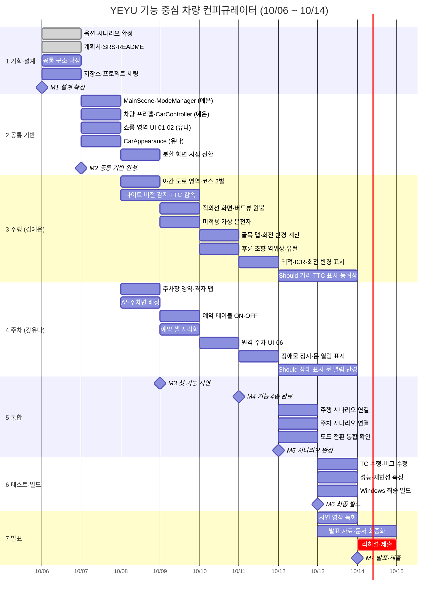

# 기능 중심 차량 컨피규레이터 WBS

> 작업 분해 구조 (Work Breakdown Structure) · 팀 YEYU
> 기준 문서: SRS v0.2 · 작성 2026.10.06 · 기간 2026.10.06(화) ~ 10.14(수), 9일

| 항목 | 내용 |
|---|---|
| 작업 시간 | 매일 09:30 ~ 19:10 (주말 포함) |
| 인원 | 김예은 (주행 파트), 강유나 (주차 파트) |
| 구조 | MainScene + 영역 씬 3개 Additive 로드 |
| 마감 회의 | 매일 19:00, 진척 확인 후 이 문서의 상태 열 갱신 |

---

## 1. 마일스톤

| ID | 마일스톤 | 날짜 | 완료 조건 |
|---|---|---|---|
| M1 | 설계 확정 | 10/6 (화) | SRS v0.2, 공통 구조(`CarConfig` 필드, 영역 좌표, 레이어·태그), 저장소 준비 |
| M2 | 공통 기반 완성 | 10/7 (수) | 옵션 선택 화면에서 외관이 바뀌고, 버튼으로 빈 주행·주차 영역에 전환됨 |
| M3 | 첫 기능 시연 | 10/9 (금) | 나이트 비전, 주차장 연동 발렛이 분할 화면에서 동작 |
| M4 | 기능 4종 완료 | 10/11 (일) | 후륜 조향, 스마트키 원격 주차까지 Must 요구사항 동작 |
| M5 | 시나리오 완성 | 10/12 (월) | 주행·주차 시나리오가 처음부터 끝까지 끊김 없이 진행 |
| M6 | 최종 빌드 | 10/13 (화) | Windows 실행 파일, TC 수행 결과 기록 |
| M7 | 발표·제출 | 10/14 (수) | 시연 영상, 발표 자료, 문서 제출 |

---

## 2. 간트 차트



---

## 3. 작업 분해 상세

상태: ✅ 완료 · 🔄 진행 중 · ⬜ 예정

### 1. 기획·설계 (10/6)

| WBS | 작업 | 담당 | 날짜 | 산출물 | 관련 요구사항 | 상태 |
|---|---|---|---|---|---|---|
| 1.1 | 기능 옵션 4종·시나리오 확정 | 공동 | 10/6 | 옵션 목록, 시나리오 흐름 | - | ✅ |
| 1.2 | 프로젝트 계획서, SRS v0.2, README 작성 | 김예은 | 10/6 | `SRS.md`, `README.md` | 전체 | ✅ |
| 1.3 | 공통 구조 확정: `CarConfig` 필드, 영역 배치 좌표, 레이어·태그 목록, 차량 3D 에셋 선정 | 공동 | 10/6 | SRS 부록 A, 에셋 | FR-36~39, NFR-06 | ⬜ |
| 1.4 | GitHub 저장소 생성, `main`/`dev` 브랜치, Unity 프로젝트 생성, `.gitignore`, Git LFS, Asset Serialization = Force Text | 김예은 | 10/6 | 저장소 | NFR-08 | ⬜ |
| 1.5 | Unity 버전 통일, 두 PC에서 프로젝트 열기 확인 | 공동 | 10/6 | - | NFR-07 | ⬜ |

### 2. 공통 기반 (10/7 ~ 10/8)

| WBS | 작업 | 담당 | 날짜 | 산출물 | 관련 요구사항 | 상태 |
|---|---|---|---|---|---|---|
| 2.1 | `MainScene`, `ModeManager`, `AreaBase` 구현. 영역 씬 3개 Additive 로드, 루트 켜고 끄기, 활성 씬 지정, `ResetArea()` | 김예은 | 10/7 | `MainScene.unity`, `ModeManager.cs`, `AreaBase.cs` | FR-36~39 | ⬜ |
| 2.2 | 공통 차량 프리팹, `CarController` (`WheelCollider`, 스크립트 입력으로 가속·조향·제동) | 김예은 | 10/7 | `Car.prefab`, `CarController.cs` | FR-10, NFR-02 | ⬜ |
| 2.3 | `ConfiguratorArea` 쇼룸 (밝은 조명, 턴테이블), UI-01 외관 선택, UI-02 기능 선택 | 강유나 | 10/7 | `ConfiguratorArea.unity`, UI 패널 | FR-04~06 | ⬜ |
| 2.4 | `CarConfig`, `CarAppearance` (색상·트림 파츠·휠 교체) | 강유나 | 10/7 | `CarConfig.cs`, `CarAppearance.cs` | FR-01~03 | ⬜ |
| 2.5 | `SplitScreenManager`(카메라 2대 좌우 분할, 라벨), `CameraSwitcher`(운전석 ↔ 버드뷰) | 공동 | 10/8 오전 | `SplitScreenManager.cs`, `CameraSwitcher.cs` | FR-11, FR-12 | ⬜ |
| 2.6 | 공통 기반 `dev` 병합, 두 PC에서 모드 전환 확인 | 공동 | 10/7 18:30 | - | M2 | ⬜ |

### 3. 주행 파트 (김예은, 10/8 ~ 10/11)

| WBS | 작업 | 날짜 | 산출물 | 관련 요구사항 | 상태 |
|---|---|---|---|---|---|
| 3.1 | `DrivingArea` 씬: 야간 외곽 도로 코스 2벌 (X=2000, 3000), 야간 조명, 헤드램프 50m, 보행자 프리팹·트리거 | 10/8 | `DrivingArea.unity`, `Pedestrian.prefab` | FR-08 | ⬜ |
| 3.2 | `NightVisionSensor`: 전방 120m 감지, 거리·상대속도·TTC 계산, 4초 경고, 2.5초 감속 요청 | 10/8 ~ 10/9 | `NightVisionSensor.cs` | FR-15, FR-17 | ⬜ |
| 3.3 | `NightVisionDisplay`: 적외선 카메라 → RenderTexture → 클러스터 흑백 화면, 노란 박스 | 10/9 | `NightVisionDisplay.cs` | FR-16 | ⬜ |
| 3.4 | 미적용 차량 가상 운전자: 보행자가 보이는 순간 + 반응 1초 후 급제동 | 10/9 | `VirtualDriver.cs` | FR-17 (TC-07) | ⬜ |
| 3.5 | `BirdViewOverlay`: 헤드램프·적외선 원뿔, 정지 거리 라벨 | 10/9 | `BirdViewOverlay.cs` | FR-18 | ⬜ |
| 3.6 | 골목 맵: 두 차량 최대 조향 궤적 측정 → 골목 회전 공간 폭 확정 | 10/10 | `DrivingArea.unity` 골목 구간 | FR-21 | ⬜ |
| 3.7 | `RearWheelSteering`: 30km/h 미만 역위상 최대 10도, 미적용 차량 3점 턴 로직 | 10/10 | `RearWheelSteering.cs` | FR-20, FR-21 | ⬜ |
| 3.8 | 회전 반경 계산·표시, 버드뷰 회전 궤적 선, ICR 점 | 10/11 | `BirdViewOverlay.cs` 확장 | FR-22, FR-23 | ⬜ |
| 3.9 | (Should) 거리·TTC 수치 표시, 60km/h 이상 동위상 2도 | 10/12 ~ 10/13 | - | FR-19, FR-24 | ⬜ |
| 3.10 | (Could) 클러스터 뒷바퀴 조향각 아이콘 | 여유 시 | - | FR-25 | ⬜ |

### 4. 주차 파트 (강유나, 10/8 ~ 10/11)

| WBS | 작업 | 날짜 | 산출물 | 관련 요구사항 | 상태 |
|---|---|---|---|---|---|
| 4.1 | `ParkingArea` 씬: 주차장 2벌 (X=4000, 5000), 조명, 격자 맵 | 10/8 | `ParkingArea.unity`, `GridMap.cs` | FR-09 | ⬜ |
| 4.2 | A* 경로 계획, 빈 주차면 배정 | 10/8 | `AStarPlanner.cs` | FR-26 | ⬜ |
| 4.3 | 예약 테이블: ON이면 예약 후 이동, OFF면 예약 없이 이동하다 경로 겹침 시 정지 | 10/9 | `ReservationTable.cs` | FR-27, FR-28 | ⬜ |
| 4.4 | 버드뷰 예약 셀 차량 색 표시 | 10/9 | - | FR-29 | ⬜ |
| 4.5 | 스마트키 원격 주차: 하차 시점 전환, UI-06, 누르는 동안 3km/h 이동, 손 떼면 0.2초 내 정지 | 10/10 | `RemoteParking.cs`, UI-06 | FR-31, FR-32 | ⬜ |
| 4.6 | 장애물 0.3m 정지, 미적용 차량 문 열림 공간 부족 표시 | 10/11 | - | FR-33, FR-34 | ⬜ |
| 4.7 | (Should) 남은 거리·대기 상태 표시, 버드뷰 문 열림 반경 | 10/12 ~ 10/13 | - | FR-30, FR-35 | ⬜ |

### 5. 통합 (10/12)

| WBS | 작업 | 담당 | 날짜 | 산출물 | 관련 요구사항 | 상태 |
|---|---|---|---|---|---|---|
| 5.1 | 주행 `ScenarioManager`: 출발 → 나이트 비전 구간 → 골목 유턴 → 종료, 두 차량 동시 출발 | 김예은 | 10/12 | `DrivingScenario.cs` | FR-11, NFR-02 | ⬜ |
| 5.2 | 주차 `ScenarioManager`: 발렛 → 원격 주차 → 종료 | 강유나 | 10/12 | `ParkingScenario.cs` | FR-11, NFR-02 | ⬜ |
| 5.3 | 모드 전환 통합: 옵션 선택 → 주행 → 옵션 선택 → 주차 반복 시 초기화·조명 확인 | 공동 | 10/12 | - | FR-37~39 | ⬜ |
| 5.4 | (Could) 결과 패널, 일시정지 | 공동 | 여유 시 | UI-05 | FR-13, FR-14 | ⬜ |

### 6. 테스트·빌드 (10/13)

| WBS | 작업 | 담당 | 날짜 | 산출물 | 관련 요구사항 | 상태 |
|---|---|---|---|---|---|---|
| 6.1 | 주행 TC 수행 (TC-02~10), 결과를 SRS 7.2에 기록 | 김예은 | 10/13 | SRS 7.2 결과 열 | FR-08~23 | ⬜ |
| 6.2 | 주차 TC 수행 (TC-11~15) | 강유나 | 10/13 | SRS 7.2 결과 열 | FR-26~34 | ⬜ |
| 6.3 | 공통 TC 수행 (TC-01, 16~18, 20~23): fps, 5회 재현성, 전환 시간 | 공동 | 10/13 | 측정 기록 | NFR-01~03, NFR-09 | ⬜ |
| 6.4 | 버그 수정 | 공동 | 10/13 | - | - | ⬜ |
| 6.5 | Windows 최종 빌드, 시연 PC에서 실행 확인 | 김예은 | 10/13 17:00 | 실행 파일 | NFR-07 | ⬜ |

### 7. 발표 (10/13 ~ 10/14)

| WBS | 작업 | 담당 | 날짜 | 산출물 | 상태 |
|---|---|---|---|---|---|
| 7.1 | 시연 영상 녹화 (주행·주차 각각 운전석·버드뷰) | 공동 | 10/13 오후 | 영상 파일 | ⬜ |
| 7.2 | 발표 자료 작성 (문제 정의, 기능 원리, 시연, 검증 결과) | 공동 | 10/13 ~ 10/14 오전 | 발표 자료 | ⬜ |
| 7.3 | README·SRS 최종화, 스크린샷·GIF 추가 | 김예은 | 10/14 오전 | `README.md`, `SRS.md` v1.0 | ⬜ |
| 7.4 | 리허설, 제출 | 공동 | 10/14 | 제출물 | ⬜ |

---

## 4. 일자별 작업표

| 날짜 | 김예은 (주행) | 강유나 (주차) | 19:00 회의에서 확인 |
|---|---|---|---|
| 10/6 (화) | 1.2 문서, 1.4 저장소 세팅 | 주차 기능 상세 검토 | 1.3 공통 구조 확정 → **M1** |
| 10/7 (수) | 2.1 ModeManager, 2.2 차량·CarController | 2.3 쇼룸·UI, 2.4 CarAppearance | 모드 전환 동작 → **M2** |
| 10/8 (목) | 2.5 분할 화면(오전), 3.1 야간 도로, 3.2 감지 시작 | 2.5 시점 전환(오전), 4.1 주차장, 4.2 A* | 영역별 맵 완성 |
| 10/9 (금) | 3.2 TTC·감속, 3.3 적외선 화면, 3.4 가상 운전자, 3.5 원뿔 | 4.3 예약 테이블, 4.4 셀 표시 | 첫 기능 시연 → **M3** |
| 10/10 (토) | 3.6 골목 맵, 3.7 후륜 조향 | 4.5 원격 주차 | |
| 10/11 (일) | 3.8 궤적·ICR·반경 표시 | 4.6 장애물·문 열림 | Must 전부 동작 → **M4** |
| 10/12 (월) | 5.1 주행 시나리오, 3.9 Should | 5.2 주차 시나리오, 4.7 Should | 5.3 통합 → **M5** |
| 10/13 (화) | 6.1 TC, 6.5 빌드, 7.1 영상 | 6.2 TC, 7.1 영상 | 6.3 공통 TC → **M6** |
| 10/14 (수) | 7.3 문서 최종화, 7.4 리허설 | 7.2 발표 자료, 7.4 리허설 | 제출 → **M7** |

---

## 5. 의존 관계와 크리티컬 패스

```
1.3 공통 구조 확정
 └─▶ 2.1 ModeManager ─┬─▶ 3.1 야간 도로 ─▶ 3.2 나이트 비전 ─▶ 3.6 골목 ─▶ 3.7 후륜 조향 ─▶ 3.8 시각화 ─┐
 └─▶ 2.2 차량·CarController ─┤                                                                          ├─▶ 5.3 통합 ─▶ 6 테스트·빌드 ─▶ 7 발표
 └─▶ 2.4 CarConfig ──────────┘─▶ 4.1 주차장 ─▶ 4.2 A* ─▶ 4.3 예약 테이블 ─▶ 4.5 원격 주차 ─▶ 4.6 ───────┘
```

**크리티컬 패스**: 1.3 → 2.1·2.2 → 3.1 → 3.2 → 3.7 → 3.8 → 5.1 → 5.3 → 6.5 → 7.4

- **2.2 `CarController`는 두 파트 모두의 선행 작업**입니다. 10/7 안에 끝나지 않으면 3·4 전체가 밀리므로, 처음에는 가속·조향·제동 입력만 받는 단순한 버전으로 먼저 병합하고 튜닝은 나중에 합니다.
- **2.4 `CarConfig` 필드는 10/6에 확정**해야 두 사람이 다음 날부터 병렬로 작업할 수 있습니다.

---

## 6. 일정 리스크와 대응

| 리스크 | 신호 | 대응 |
|---|---|---|
| 공통 기반(10/7)이 늦어짐 | 10/7 19:00에 모드 전환이 안 됨 | 10/8 오전까지 연장, 분할 화면(2.5)은 각자 영역에서 임시 카메라로 대체 |
| 나이트 비전 적외선 화면 구현 지연 | 10/9 15:00에 RenderTexture 미동작 | 적외선 화면을 흑백 UI 이미지 + 박스만으로 단순화 |
| 후륜 조향 물리 불안정 | 10/10에 `WheelCollider` 뒷바퀴 조향 시 미끄러짐 | 골목 유턴 구간만 기구학 모델로 위치를 직접 계산 |
| 예약 테이블 교착 | 10/9에 ON 상태에서도 차량이 멈춤 | 대기 10초 후 재계획(FR-27 예외 처리) 먼저 구현 |
| 통합 시 버그 폭증 | 10/12 19:00에 시나리오 미완성 | Should·Could 작업(3.9, 4.7, 5.4) 전부 보류, 10/13 오전까지 버그 수정 |

**버퍼**: 10/12 ~ 10/13에 Should 작업으로 잡아둔 시간(3.9, 4.7)이 실질적인 예비 시간입니다. Must가 밀리면 이 시간을 먼저 씁니다.

---

## 7. 요구사항 대응표

| 요구사항 | WBS |
|---|---|
| FR-01~03, FR-10 | 2.4 |
| FR-04~06 | 2.3 |
| FR-08 | 3.1 |
| FR-09 | 4.1 |
| FR-11 | 2.5, 5.1, 5.2 |
| FR-12 | 2.5 |
| FR-13, FR-14 | 5.4 |
| FR-15~18 | 3.2 ~ 3.5 |
| FR-19, FR-24 | 3.9 |
| FR-20~23 | 3.6 ~ 3.8 |
| FR-25 | 3.10 |
| FR-26~29 | 4.2 ~ 4.4 |
| FR-30, FR-35 | 4.7 |
| FR-31~34 | 4.5, 4.6 |
| FR-36~39 | 2.1, 5.3 |
| NFR-01~03, NFR-09 | 6.3 |
| NFR-07 | 6.5 |
| NFR-08 | 1.4 |
