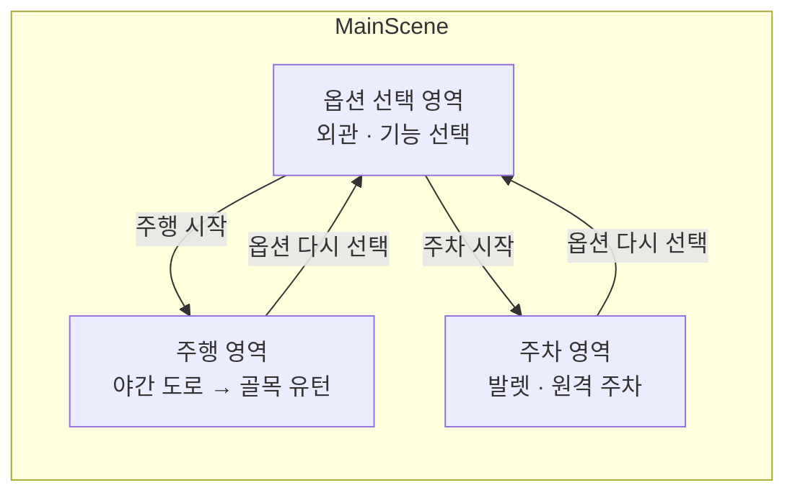

# 기능 중심 차량 컨피규레이터 (가제)

> 이름만 봐서는 "이게 정확히 뭐지?" 싶은 고급 차량 옵션을,
> **선택 안 했을 때 vs 선택했을 때**를 분할 화면 시뮬레이션으로 직접 보여주는 Unity 차량 컨피규레이터


| 항목 | 내용 |
| --- | --- |
| 팀 | YEYU (김예은, 강유나) |
| 개발 기간 | 2026.10.06 ~ 2026.10.14 |
| 실행 환경 | Windows 10 이상, 1920×1080 |

---

## 프로젝트 소개

기존 차량 컨피규레이터는 색상, 휠 같은 **외관**만 보여줍니다.
나이트 비전, 후륜 조향, 원격 주차 같은 고급 **기능 옵션**은 설명만으로는 실제로 무엇이 달라지는지 알기 어렵습니다.

- 외관 옵션(색상·트림·휠)을 실시간 3D 미리보기로 확인
- 기능 옵션을 고르면 **옵션 미적용 차량과 적용 차량이 같은 상황을 동시에 진행**하는 분할 화면으로 비교
- **운전석 시점**과 **버드뷰**를 전환하며 기능의 동작 원리까지 시각화

---

## 기능 옵션

| 구분 | 옵션 | 한 줄 설명 | 담당 |
| --- | --- | --- | --- |
| 주행 | 🌙 나이트 비전 | 헤드램프가 닿지 않는 어둠 속 보행자를 적외선으로 먼저 찾아냅니다 | 김예은 |
| 주행 | 🔄 후륜 조향 | 뒷바퀴도 함께 꺾여 좁은 곳에서 더 작게 회전합니다 | 김예은 |
| 주차 | 🅿️ 주차장 연동 발렛 | 주차장 관제와 연동해 다른 차와 부딪히지 않고 빈자리를 찾아갑니다 | 강유나 |
| 주차 | 🔑 스마트키 원격 주차 | 차 밖에서 스마트키 버튼으로 좁은 칸에 주차합니다 | 강유나 |

---

## 앱 흐름

로딩 없는 하나의 실행 화면입니다. 앱 시작 시 `MainScene`이 영역 씬 3개를 Additive로 불러오고, 이후에는 영역을 켜고 끄며 전환합니다.



| 씬 | 내용 | 수정 담당 |
| --- | --- | --- |
| `MainScene` | `ModeManager`, 공통 UI | 미정 |
| `ConfiguratorArea` | 쇼룸, 외관·기능 선택 | 미정 |
| `DrivingArea` | 야간 도로 코스 2벌, 골목 | 김예은 |
| `ParkingArea` | 주차장 2벌 | 강유나 |

---

## 시나리오

### 🚗 주행: 야간 귀가길

| 구간 | 기능 | 옵션 미적용 (왼쪽) | 옵션 적용 (오른쪽) |
| --- | --- | --- | --- |
| ① 야간 외곽 도로 | 나이트 비전 | 보행자를 눈앞에서야 발견 → 급제동 | 적외선 화면에 보행자 박스 → 미리 감속 |
| ② 막다른 골목 | 후륜 조향 | 한 번에 못 돌고 3점 턴 | 뒷바퀴 역위상 조향으로 한 번에 유턴 |

### 🅿️ 주차 (확정 예정)

| 기능 | 옵션 미적용 (왼쪽) | 옵션 적용 (오른쪽) |
| --- | --- | --- |
| 주차장 연동 발렛 | 예약 테이블 OFF: 경로가 겹치는 곳에서 정지 | 예약 테이블 ON: 셀 예약 후 충돌 없이 주차 |
| 스마트키 원격 주차 | 운전자가 탄 채 주차 → 문 열 공간 부족 | 먼저 내린 뒤 스마트키로 주차 |

---

## 기술적 포인트

| 기능 | 로봇 공학 개념 | 구현 |
| --- | --- | --- |
| 나이트 비전 | 인지 → 판단 → 제어 | 가상 적외선 센서 → 거리·TTC → 경고·감속 |
| 후륜 조향 | 차량 기구학 | 자전거 모델 회전 반경, ICR 시각화 |
| 주차장 연동 발렛 | 다중 로봇 경로 계획 | 격자 맵 + A* + 시공간 예약 테이블 |
| 스마트키 원격 주차 | 원격 조작 안전 설계 | 버튼 해제 즉시 정지, 근접 장애물 정지 |

$$R = \frac{L}{\tan\delta_f - \tan\delta_r} \qquad TTC = \frac{d}{v_{rel}}$$

---

## 프로젝트 구조

```
Assets/
├── _Project/
│   ├── Scenes/          MainScene, ConfiguratorArea, DrivingArea, ParkingArea
│   ├── Scripts/
│   │   ├── Core/        영역 전환, CarConfig          (공통)
│   │   ├── Vehicle/     CarController, ICarFeature    (공통)
│   │   ├── Camera/      분할 화면, 시점 전환           (공통)
│   │   ├── Scenario/    시나리오 공통 틀               (공통)
│   │   ├── UI/          공통 Canvas 패널               (공통)
│   │   ├── Utils/
│   │   ├── Driving/     나이트 비전, 후륜 조향         (김예은)
│   │   └── Parking/     발렛, 원격 주차                (강유나)
│   ├── Prefabs/  Data/  Materials/  Shaders/  RenderTextures/  Audio/  UI/
└── ThirdParty/          외부 에셋 (수정 금지)
Docs/                    SRS, WBS, 프로젝트 구조
```

파일별 역할과 공통 파일 담당은 [`Docs/PROJECT_STRUCTURE.md`](Docs/PROJECT_STRUCTURE.md)를 봅니다.

---

## 시작하기

### 요구 사항

- Unity Hub, Unity Editor (버전 확정 후 기재)
- Git, [Git LFS](https://git-lfs.com)

### 처음 받을 때

```bash
git lfs install
git clone https://github.com/<OWNER>/YEYU-Configurator.git
```

1. Unity Hub → **Add project from disk** → 받은 폴더 선택
2. `Assets/_Project/Scenes/MainScene.unity` 열기 → ▶ Play

### 최초 1회 Unity 설정 (프로젝트 만든 사람)

- **Edit → Project Settings → Editor**
  - Version Control Mode: **Visible Meta Files**
  - Asset Serialization Mode: **Force Text**
- Build Settings 씬 순서: `MainScene`(0) → `ConfiguratorArea` → `DrivingArea` → `ParkingArea`

---

## 협업 규칙

### 브랜치

| 브랜치 | 용도 |
| --- | --- |
| `main` | 발표·제출용 안정 버전 |
| `dev` | 통합 브랜치 (매일 빌드 성공 상태 유지) |
| `feature/<기능명>` | 기능 개발 (예: `feature/night-vision`, `feature/valet-parking`) |

작업 흐름: `dev`에서 `feature/*` 생성 → 작업 → `dev`로 Pull Request → 상대 확인 후 병합

### 커밋 메시지

```
feat: 나이트 비전 TTC 감속 로직 추가
fix: 분할 화면 카메라 비율 오류 수정
docs: SRS FR-21 인수 기준 수정
refactor: CarConfig 필드 이름 정리
```

### 충돌 방지

- `DrivingArea.unity`, `Scripts/Driving/`는 김예은, `ParkingArea.unity`, `Scripts/Parking/`는 강유나만 수정합니다.
- `MainScene`, `ConfiguratorArea`, 공통 스크립트, 공통 프리팹, `ProjectSettings/`는 **수정 전에 상대에게 알리고**, 수정 후 바로 `dev`에 병합합니다.

---

## 문서

- [SRS (요구사항 명세서)](Docs/SRS.md)
- [WBS](Docs/WBS.md) · [WBS 엑셀](Docs/WBS.xlsx)
- [프로젝트 구조](Docs/PROJECT_STRUCTURE.md)
