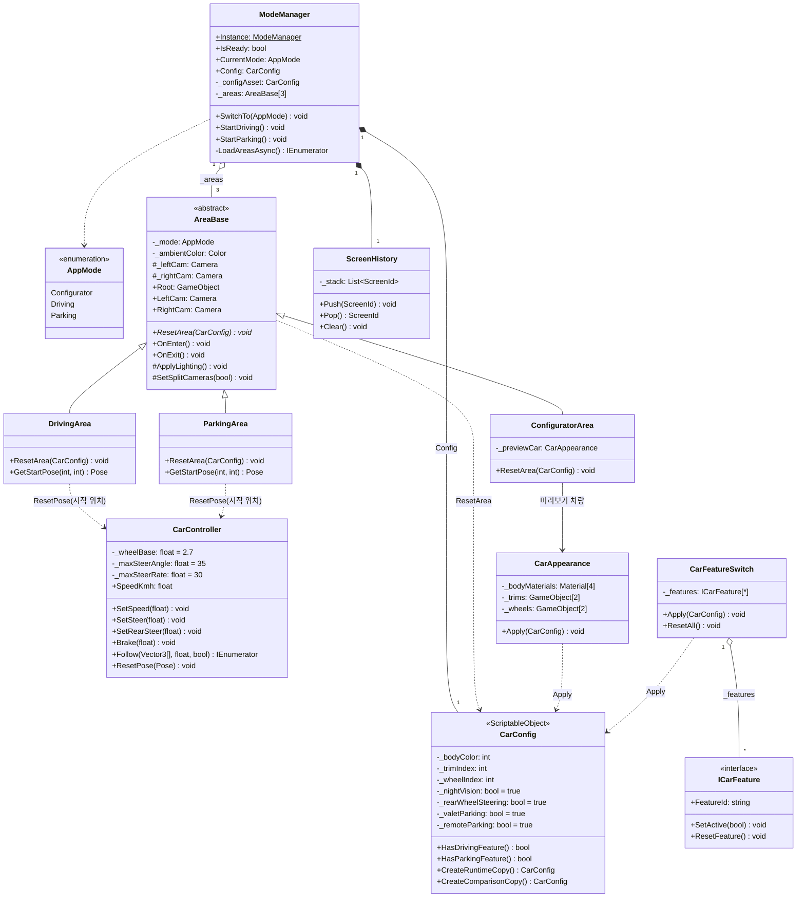
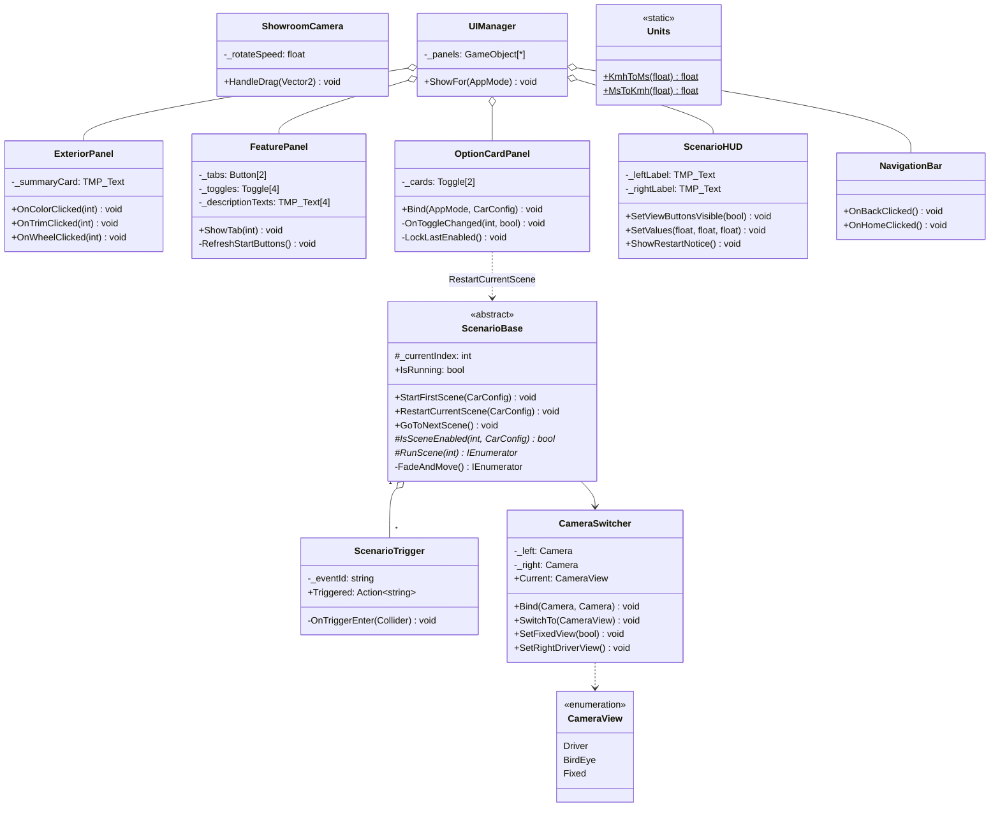
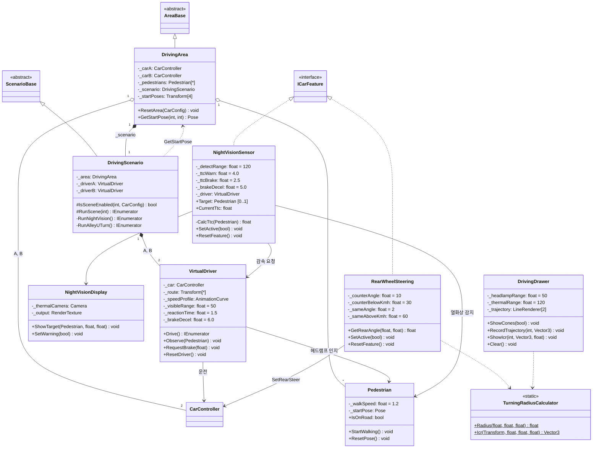
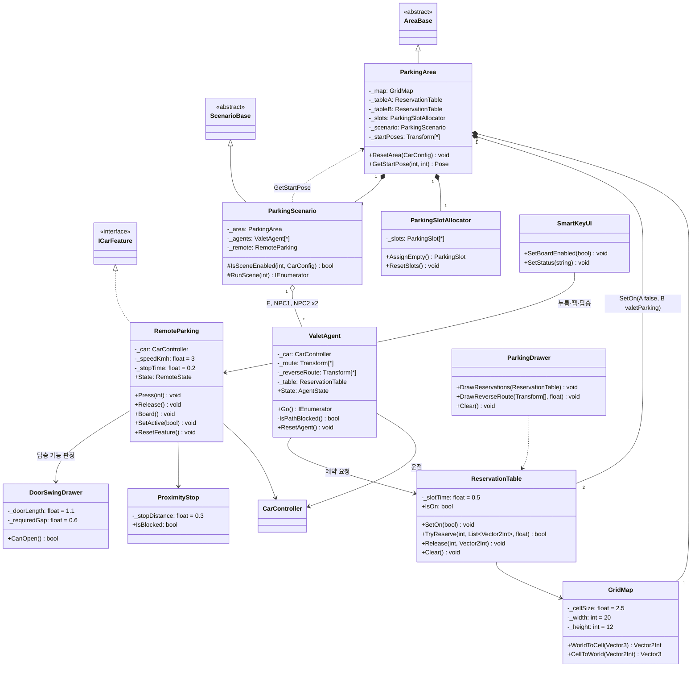

# 클래스 설계서

> 팀 YEYU · 작성 김예은 · 2026.10.07 · 기준: SRS v0.7, `FOLDER_STRUCTURE.md` 5장 · 클래스 다이어그램 1·2차 피드백 반영본
> 파일 하나 = 클래스 하나. 이름은 `CONVENTIONS.md`(private 필드 `_camelCase`, 네임스페이스 `Yeyu.<폴더>`)를 따른다.

## 1차 피드백 반영

| 번호 | 피드백 | 반영 |
| --- | --- | --- |
| 0 | FeaturePanel의 ScriptableObject 과함 | `FeatureDescriptions` 삭제. `FeaturePanel._descriptionTexts: TMP_Text[4]`에 Inspector로 입력 |
| 1 | 오른쪽 차량 운전자 없음 | 두 차량 모두 `VirtualDriver`가 운전. 오른쪽만 기능 컴포넌트 ON, 센서는 `RequestBrake()`로 운전자에게 감속 요청 |
| 2 | 조명 전환 책임 없음 | `AreaBase.ApplyLighting()` 추가, `OnEnter()`에서 영역별 ambient 적용 |
| 3 | 측정 책임 없음 | 측정·결과 기록 자체를 범위에서 제외: `ScenarioResult`, `ResultPanel` 삭제 (SRS v0.7 FR-13·UI-05 삭제) |
| 4 | 차량 원위치 불가 | `CarController.ResetPose(Pose)` 추가 (위치·속도·조향각 초기화) |
| 5 | ValetAgent가 ICarFeature 구현 | `ValetAgent`는 일반 클래스로 변경 (예약 테이블 처리 방식은 2차 피드백 1번에서 다시 수정) |
| 6 | IPathProvider + Waypoint + AStar | 셋 다 삭제, 웨이포인트는 `ValetAgent._route`로 흡수 (SRS FR-46·NFR-10 삭제) |
| 7 | IVehicleDriver + BicycleModelDriver 중복 | 둘 다 삭제, 구동은 `CarController` 하나(자전거 모델)로 통일 (SRS FR-43 수정, NFR-11 삭제) |
| 8 | ReverseParkingPlanner + PurePursuitController | 둘 다 삭제, 후진은 미리 찍은 `_reverseRoute` 웨이포인트 추종 (SRS FR-40·41 수정, FR-45 삭제) |
| 9 | Drawer 6개 + DebugDraw | `DrivingDrawer`, `ParkingDrawer`로 통합, `DoorSwingDrawer`만 유지, `DebugDraw` 삭제 |
| 10 | AreaBase, ScenarioBase, ICarFeature 좋음 | 유지 |

결과: 클래스 54개 → 41개.

## 2차 피드백 반영

| 번호 | 피드백 | 반영 |
| --- | --- | --- |
| 1 | `ReservationTable`이 `ICarFeature`를 구현하지만 주차장에 있어 `CarFeatureSwitch`가 찾을 수 없음 | `ICarFeature` 구현 제거. `ParkingArea.ResetArea(config)`가 `SetOn(valetParking)`으로 직접 켜고 끔. `ICarFeature` 구현은 차량에 붙는 3종(NightVisionSensor, RearWheelSteering, RemoteParking)만 남음 |
| 2 | `ResetPose(Pose)`의 시작 위치를 누가 저장하는지 없음 | `DrivingArea`·`ParkingArea`에 장면별·차량별 시작 위치 `_startPoses`와 `GetStartPose(장면, 차량)` 추가. `CarController`는 위치를 저장하지 않고 받은 Pose로만 복귀 |

## 표기법

| 표기 | 의미 |
| --- | --- |
| `+` `-` `#` | public, private, protected |
| 밑줄 (Mermaid `$`) | static |
| 기울임 (Mermaid `*`) | 추상 메서드 |
| `«interface»` `«abstract»` `«enumeration»` `«ScriptableObject»` `«static»` | 스테레오 타입 |
| `[*]` `[0..1]` `[2]` | 다중성: 개수 미정 / 0개 또는 1개 / 고정 개수 |
| `<\|--` / `<\|..` | 상속 / 실체화(인터페이스 구현) |
| `o--` / `*--` | 집합(참조만, 씬에 따로 존재) / 합성(같은 오브젝트의 일부) |
| `-->` / `..>` | 연관(필드로 보유) / 의존(인자로 받거나 잠깐 호출) |

## 도면 1. 뼈대 — Core · Vehicle (공통)

- `ModeManager`는 `SwitchTo(AppMode)`로 `AreaBase` 3개만 다룬다. 영역 안 클래스와는 선이 없다.
- `AreaBase.OnEnter()`가 영역별 조명(`ApplyLighting()`: `RenderSettings.ambientLight` 등)과 분할 카메라 2대(`SetSplitCameras(true)`)를 켠다(FR-11, FR-38). `ModeManager`는 활성 씬만 지정한다.
- `CarController`가 모든 차량의 유일한 구동부다. 자전거 모델로 위치·방향을 갱신하고(FR-43, 뒷바퀴 조향 포함), `Follow()`로 웨이포인트를 따라간다(FR-41).
- 시작 위치는 차가 아니라 영역이 보관한다: `DrivingArea`·`ParkingArea`가 장면별·차량별 시작 위치를 들고 있다가 `GetStartPose(장면, 차량)`으로 꺼내 `CarController.ResetPose(Pose)`에 넘긴다(FR-39). 장면을 다시 시작할 때는 각 시나리오가 같은 함수로 꺼낸다.
- `CarConfig` 기능 값 4개의 초기값은 모두 true(FR-05). 실행 중에는 `CreateRuntimeCopy()` 복사본을 수정한다. ScriptableObject는 이 하나뿐이다.
- `ScreenHistory`는 뒤로가기·홈의 화면 이동 기록이다(FR-53·54). `ScreenId`는 같은 파일의 중첩 enum이다.

## 도면 2. 공용 — Scenario · Camera · UI · Utils (공통)

- `ScenarioBase`가 장면 순서(FR-57), 꺼진 장면 건너뛰기(FR-62·63), 토글 시 재시작(FR-48), 0.5초 페이드를 맡는다. 자식은 `IsSceneEnabled`와 `RunScene`만 구현한다.
- 분할 화면 역할: 카메라 2대 켜기·끄기는 `AreaBase`, 시점 전환은 `CameraSwitcher`(영역에 들어올 때 `Bind(LeftCam, RightCam)`), 좌우 라벨은 `ScenarioHUD`.
- `FeaturePanel`은 설명 문구 4개를 `TMP_Text` 필드에 Inspector로 직접 입력한다(SRS 부록 A 문구).

## 도면 3. 주행 — Driving (김예은)

- 빈 상자(AreaBase, ScenarioBase, ICarFeature, CarController)는 도면 1·2의 클래스를 다시 표시한 것이다.
- 두 차량 모두 `VirtualDriver`가 같은 경로·속도 프로파일로 운전한다. 오른쪽 차량에서만 `NightVisionSensor`·`RearWheelSteering`이 켜지고, 센서는 운전자에게 `RequestBrake(5.0)`를 보낸다. 왼쪽 운전자는 헤드램프 50m 인지 → 1.5초 → 6.0m/s²로만 반응한다.
- 골목 유턴도 `VirtualDriver`가 웨이포인트 경로를 따라간다. 왼쪽은 3회 유턴 경로, 오른쪽은 1회 경로를 쓰고 후륜 조향이 `SetRearSteer`로 뒷바퀴를 꺾는다.
- 그리는 일은 `DrivingDrawer` 하나가 맡는다(헤드램프·열화상 원뿔, 회전 궤적, ICR, 반경 라벨).

## 도면 4. 주차 — Parking (강유나, 검토 필요)

- `ICarFeature`는 차량에 붙는 `RemoteParking`만 구현한다. 발렛 옵션의 실체인 `ReservationTable`은 차가 아니라 주차장에 있어 `CarFeatureSwitch`가 찾을 수 없으므로, `ParkingArea.ResetArea()`가 `SetOn(valetParking)`으로 직접 켜고 끈다(주차장 A는 항상 `SetOn(false)`).
- `ValetAgent`는 기능이 아니라 차량을 움직이는 에이전트다. E와 NPC 모두 같은 클래스이고, 전역 웨이포인트(`_route`)와 후진 웨이포인트(`_reverseRoute`)를 `CarController.Follow()`로 따라간다. 테이블이 OFF면 예약 없이 가다가 앞이 막히면 정지한다(FR-28).
- 그리는 일은 `ParkingDrawer` 하나(예약 셀, 후진 웨이포인트)가 맡고, 탑승 가능 판정(`CanOpen`)이 있는 `DoorSwingDrawer`만 따로 둔다.

## 클래스 도출표

| 네임스페이스 | 클래스 | 수 |
| --- | --- | --- |
| `Yeyu.Core` | ModeManager, AreaBase, AppMode, CarConfig, ConfiguratorArea, ScreenHistory | 6 |
| `Yeyu.Vehicle` | CarController, CarAppearance, CarFeatureSwitch, ICarFeature | 4 |
| `Yeyu.Camera` | CameraSwitcher (+ CameraView), ShowroomCamera | 2 |
| `Yeyu.Scenario` | ScenarioBase, ScenarioTrigger | 2 |
| `Yeyu.UI` | UIManager, ExteriorPanel, FeaturePanel, ScenarioHUD, OptionCardPanel, NavigationBar | 6 |
| `Yeyu.Utils` | Units | 1 |
| `Yeyu.Driving` | DrivingArea, DrivingScenario, VirtualDriver, Pedestrian, NightVisionSensor, NightVisionDisplay, RearWheelSteering, TurningRadiusCalculator, DrivingDrawer | 9 |
| `Yeyu.Parking` | ParkingArea, ParkingScenario, GridMap, ParkingSlotAllocator, ReservationTable, ValetAgent, RemoteParking, SmartKeyUI, ProximityStop, ParkingDrawer, DoorSwingDrawer | 11 |
| 합계 | | 41 |

## CarConfig 기능 값과 켜는 곳

| CarConfig 필드 | 구현 클래스 | 붙는 곳 | 장면 |
| --- | --- | --- | --- |
| nightVision | NightVisionSensor | 차량 (`CarFeatureSwitch`가 켜고 끔) | 주행 1 |
| rearWheelSteering | RearWheelSteering | 차량 (`CarFeatureSwitch`) | 주행 2 |
| valetParking | ReservationTable (ICarFeature 아님) | 주차장 B (`ParkingArea.ResetArea()`가 `SetOn(valetParking)`) | 주차 1 |
| remoteParking | RemoteParking | 차량 (`CarFeatureSwitch`) | 주차 2 |
