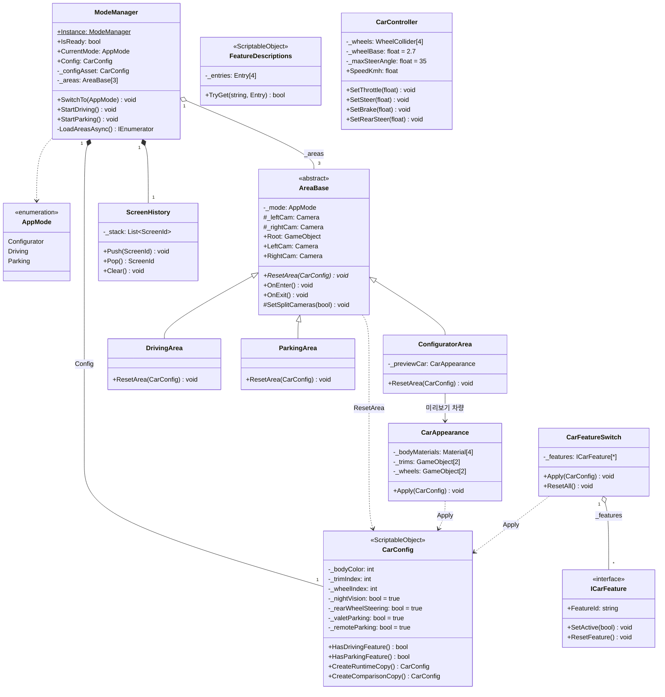
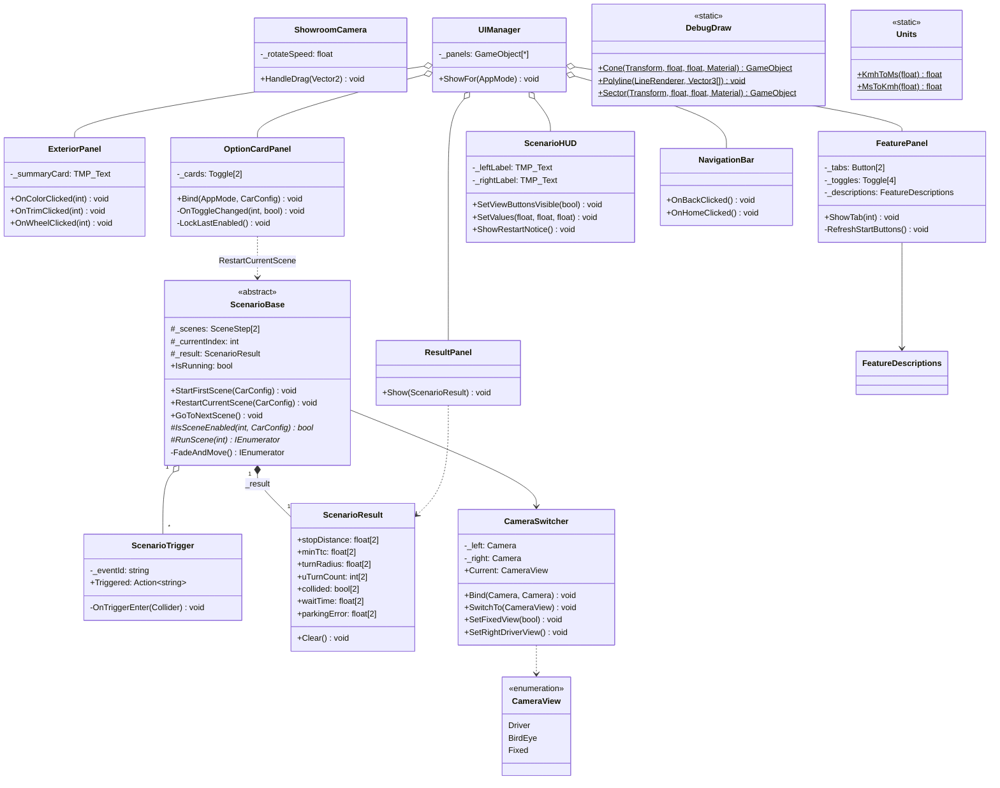
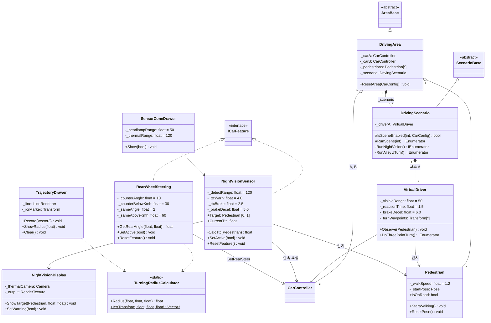
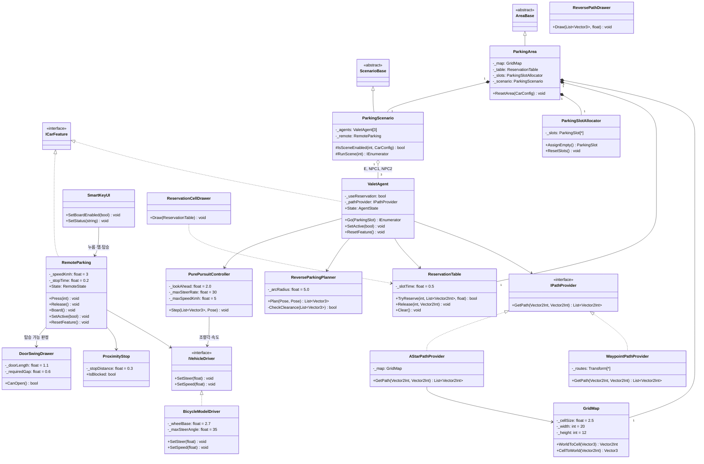

# 클래스 설계서

> 팀 YEYU · 작성 김예은 · 2026.10.07 · 기준: SRS v0.6, `FOLDER_STRUCTURE.md` 5장
> 파일 하나 = 클래스 하나. 이름은 `CONVENTIONS.md`(private 필드 `_camelCase`, 네임스페이스 `Yeyu.<폴더>`)를 따른다.

## 표기법

| 표기 | 의미 |
| --- | --- |
| `+` `-` `#` | public, private, protected |
| 밑줄 (Mermaid `$`) | static |
| 기울임 (Mermaid `*`) | 추상 메서드 |
| `«interface»` `«abstract»` `«enumeration»` `«ScriptableObject»` `«static»` | 스테레오 타입 |
| `[*]` `[0..1]` `[2]` | 다중성: 개수 미정 / 0개 또는 1개 / 고정 개수 |
| `<\|--` / `<\|..` | 상속 / 실체화(인터페이스 구현) |
| `o--` / `*--` | 집합(참조만, 씬에 따로 존재) / 합성(같은 오브젝트의 일부) |
| `-->` / `..>` | 연관(필드로 보유) / 의존(인자로 받거나 잠깐 호출) |

## 도면 1. 뼈대 — Core · Vehicle (공통)

- `ModeManager`는 `SwitchTo(AppMode)`로 `AreaBase` 3개만 다룬다. 영역 안 클래스와는 선이 없다. 분할 카메라 2대는 각 영역의 `AreaBase`가 `OnEnter()`·`OnExit()`에서 켜고 끈다(ConfiguratorArea는 쇼룸 카메라 1대).
- Car.prefab에 `CarAppearance` · `CarFeatureSwitch` · 구동부 · 기능 컴포넌트가 함께 붙는다. 기능은 `ICarFeature` 타입으로 켜고 끈다(NFR-06).
- `CarConfig` 기능 값 4개의 초기값은 모두 true(FR-05). 실행 중에는 `CreateRuntimeCopy()` 복사본을 수정한다.
- `ScreenHistory`는 뒤로가기·홈의 화면 이동 기록이다(SRS 6장, FR-53·54). `ScreenId`는 같은 파일의 중첩 enum이다.

## 도면 2. 공용 — Scenario · Camera · UI · Utils (공통)

- `ScenarioBase`가 장면 순서(FR-57), 꺼진 장면 건너뛰기(FR-62·63), 토글 시 재시작(FR-48), 0.5초 페이드를 맡는다. 자식은 `IsSceneEnabled`와 `RunScene`만 구현한다.
- `ScenarioResult`의 배열 길이 2는 [0] 왼쪽(미적용), [1] 오른쪽(적용)이다.
- 분할 화면은 역할을 셋으로 나눈다: 카메라 2대를 왼쪽·오른쪽 Viewport로 켜고 끄는 일은 `AreaBase.SetSplitCameras()`(영역마다 카메라가 다르므로), 시점 전환은 `CameraSwitcher`(영역에 들어올 때 `Bind(LeftCam, RightCam)`), 좌우 라벨 "옵션 미적용 / 선택 옵션 적용"은 `ScenarioHUD`가 맡는다.

## 도면 3. 주행 — Driving (김예은)

- 빈 상자(AreaBase, ScenarioBase, ICarFeature, CarController)는 도면 1·2의 클래스를 다시 표시한 것이다.
- `NightVisionSensor`와 `RearWheelSteering`은 `ICarFeature`를 구현하고 오른쪽 차량에서만 켜진다. 왼쪽 차량은 `VirtualDriver`가 운전한다.
- 필드 기본값은 SRS v0.6과 SCENARIO.md 2·3장 값이다. `TurningRadiusCalculator.Radius(L, δf, δr)`는 R = L ÷ (tan δf − tan δr)이며 상태가 없어 static이다.

## 도면 4. 주차 — Parking (강유나, 검토 필요)

- SRS 2.1 '주차 영역 차량 이동 구조'를 그대로 옮겼다: 경로 공급부 → 예약 테이블 → 후진 궤적 → Pure Pursuit → 구동부.
- `IPathProvider`(NFR-10)와 `IVehicleDriver`(NFR-11)를 실체화로 분리해, 구현을 바꿔도 `ValetAgent`·`PurePursuitController` 코드는 그대로다.
- `RemoteParking`은 원격 이동(FR-31~33)과 탑승(FR-64~66)을 맡고, 탑승 가능 판정은 `DoorSwingDrawer.CanOpen()`으로 한다.

## 클래스 도출표

| 네임스페이스 | 클래스 | 수 |
| --- | --- | --- |
| `Yeyu.Core` | ModeManager, AreaBase, AppMode, CarConfig, FeatureDescriptions, ConfiguratorArea, ScreenHistory | 7 |
| `Yeyu.Vehicle` | CarController, CarAppearance, CarFeatureSwitch, ICarFeature | 4 |
| `Yeyu.Camera` | CameraSwitcher (+ CameraView), ShowroomCamera | 2 |
| `Yeyu.Scenario` | ScenarioBase, ScenarioTrigger, ScenarioResult | 3 |
| `Yeyu.UI` | UIManager, ExteriorPanel, FeaturePanel, ScenarioHUD, OptionCardPanel, NavigationBar, ResultPanel | 7 |
| `Yeyu.Utils` | DebugDraw, Units | 2 |
| `Yeyu.Driving` | DrivingArea, DrivingScenario, VirtualDriver, Pedestrian, NightVisionSensor, NightVisionDisplay, RearWheelSteering, TurningRadiusCalculator, SensorConeDrawer, TrajectoryDrawer | 10 |
| `Yeyu.Parking` | ParkingArea, ParkingScenario, GridMap, ParkingSlotAllocator, IPathProvider, WaypointPathProvider, AStarPathProvider, ReservationTable, ValetAgent, ReverseParkingPlanner, PurePursuitController, IVehicleDriver, BicycleModelDriver, RemoteParking, SmartKeyUI, ProximityStop, ReservationCellDrawer, ReversePathDrawer, DoorSwingDrawer | 19 |
| 합계 | | 54 |

## ICarFeature 구현과 CarConfig 필드 대응

| CarConfig 필드 | 구현 클래스 | 장면 |
| --- | --- | --- |
| nightVision | NightVisionSensor | 주행 1 |
| rearWheelSteering | RearWheelSteering | 주행 2 |
| valetParking | ValetAgent (`_useReservation`) | 주차 1 |
| remoteParking | RemoteParking | 주차 2 |
